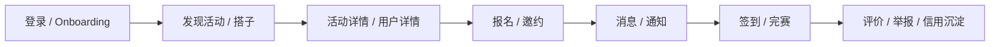

# USport 多端原型说明

文档版本：V1.0  
更新时间：2026-03-22

## 1. 原型目标

本原型覆盖三个端：

1. 微信小程序端
2. 移动端
3. 运营后台

目标不是一次性画全量页面，而是先把 MVP 的主链路原型化：

- 登录
- 发现
- 成局
- 履约
- 治理

## 2. 信息架构总览

## 3. 小程序端原型

### 3.1 首页

页面目标：

- 让用户在 10 秒内看到可参与的局
- 让新用户明白“今天就能约上”

结构：

1. 顶部城市与天气条
2. 运动筛选胶囊
3. 官方托底活动 Hero
4. 附近热门活动列表
5. 热门场馆横滑区
6. 新手引导入口

核心交互：

- 点击筛选立即刷新列表
- Hero 区 CTA 直接进入活动详情
- 下拉刷新不打断筛选状态

### 3.2 活动详情

结构：

1. 封面和状态标签
2. 时间、地点、人数、费用
3. 发起人和信用信息
4. 活动说明
5. 适合人群 / 门槛标签
6. 固定底部报名按钮

关键规则：

- 不可报名原因要直接可见
- 高风险场景要有安全提示

### 3.3 创建活动

结构：

1. 运动类型
2. 时间和报名截止
3. 地点与区域
4. 人数与费用
5. 可见性和报名规则
6. 提交按钮

### 3.4 消息

结构：

1. 系统通知
2. 活动群聊
3. 邀约私聊

### 3.5 我的

结构：

1. 用户头图和资料完成度
2. 我的活动
3. 我的邀约
4. 信用分
5. 设置与帮助

## 4. 移动端原型

### 4.1 发现页

页面目标：

- 比小程序更强地支持搭子和活动双发现

结构：

1. 顶部大标题与当前位置
2. 发现切换：
   `活动` / `搭子`
3. 智能推荐模块
4. 运动筛选与排序
5. 活动卡片流或搭子卡片流

### 4.2 搭子详情

结构：

1. 头像、昵称、城市
2. 主运动与技能等级
3. 常活动区域和时段
4. 近期到场记录
5. 发起邀约按钮
6. 举报 / 拉黑入口

### 4.3 邀约页

结构：

1. 已收到
2. 已发出
3. 状态标签和超时提示

### 4.4 活动详情

相比小程序增加：

- 更多参与成员信息
- 聊天入口
- 历史履约和评价信息

### 4.5 消息页

结构：

1. 会话列表
2. 未读状态
3. 系统通知入口

### 4.6 我的页

结构：

1. 会员与等级区
2. 我的活动
3. 我的邀约
4. 信用记录
5. 资料设置

## 5. 运营后台原型

### 5.1 总览面板

展示：

- 本周活跃用户
- 成局率
- 到场率
- 举报量
- 高风险活动数

### 5.2 活动管理

结构：

1. 筛选条
2. 活动列表
3. 状态标签
4. 快捷操作：
   查看 / 取消 / 推荐

### 5.3 举报工单

结构：

1. 工单列表
2. 举报原因
3. 证据预览
4. 处理动作
5. 审计日志

### 5.4 用户治理

结构：

1. 用户基础信息
2. 风险标签
3. 信用记录
4. 封禁 / 限权 / 解封

## 6. 页面流转

### 6.1 新用户首次使用

登录 -> 选择运动 -> 首页推荐局 -> 活动详情 -> 报名 -> 通知确认

### 6.2 邀约流

发现搭子 -> 用户详情 -> 发起邀约 -> 对方接受 -> 会话 -> 线下见面

### 6.3 组局流

创建活动 -> 发布 -> 报名审核 -> 群聊 -> 签到 -> 完赛 -> 评价

## 7. 关键组件清单

必须优先出原型的组件：

- 顶部城市条
- 运动筛选胶囊
- 活动卡片
- 搭子卡片
- 信用徽章
- 风险提示条
- 固定底部 CTA
- 状态标签
- 后台工单表格

## 8. 原型优先级

### P0

- 小程序：首页、活动详情、创建活动、我的
- 移动端：发现页、搭子详情、活动详情、消息、我的
- 后台：总览、举报工单、活动管理

### P1

- 小程序：通知、资料编辑
- 移动端：邀约页、会员页、信用页
- 后台：用户治理、运营配置

## 9. 说明

这份原型说明是结构与交互层的真源。  
实际高保真视觉稿和前端实现，都应以 [USport-DESIGN.md](/D:/Ufren-workspace/USport/docs/design/USport-DESIGN.md) 的设计系统为基础继续细化。
