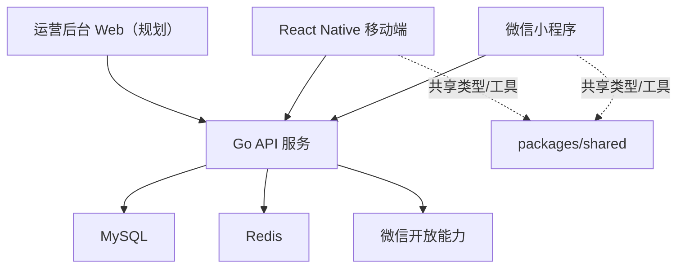

# USport 技术架构说明

文档版本：V1.0  
更新时间：2026-03-22  
适用范围：`apps/mini-program`、`apps/mobile`、`services/api`、未来管理后台

## 1. 文档目的

本文档用于回答以下问题：

1. USport 为什么适合采用多端 monorepo 架构。
2. 小程序端、移动端、后端、共享包分别承担什么职责。
3. 现阶段代码实现与目标架构之间有哪些差距。
4. 后续迭代时如何保持工程边界清晰、减少重复开发。

## 2. 业务与技术目标

USport 的目标不是单一前端应用，而是围绕“运动搭子 + 组局 + 线下履约 + 信任体系”的完整产品矩阵。因此技术架构必须满足以下要求：

- 同一业务规则可以被小程序端和移动端复用。
- 用户、邀约、活动、信用、支付等核心模型必须统一。
- 支持从 MVP 快速演进到多城市、多运动品类。
- 允许不同端的节奏不同，但不能造成接口和字段长期漂移。
- 便于后续增加运营后台、增长活动页、消息系统和推荐能力。

## 3. 整体架构



## 4. 多端职责划分

### 4.1 小程序端

定位：获客、轻量使用、快速转化。

适合承载的能力：

- 微信授权登录
- 新用户 onboarding
- 附近活动发现
- 快速报名、退出、签到
- 官方活动和运营活动承接
- 消息提醒和轻社交

不建议优先承载的能力：

- 重度连续聊天
- 高频复杂筛选
- 复杂会员权益运营
- 长链路创作者型内容生产

### 4.2 移动端

定位：高频留存、深度互动、长期关系沉淀。

适合承载的能力：

- 完整用户档案编辑
- 高频活动发现与管理
- 邀约、组局、聊天、评价
- 信用记录查看与申诉
- 会员权益消费
- 更复杂的消息中心和个人中心

### 4.3 运营后台

定位：平台治理和城市运营。

必须支持：

- 用户审核与封禁
- 举报工单处理
- 官方活动创建与发布
- 推荐位、Banner、标签和规则配置
- 会员订单与退款处理
- 数据报表和异常监控入口

### 4.4 后端 API

定位：统一业务中台，而不是“给某一端单独写接口”。

必须统一的内容：

- 鉴权与会话
- 用户主数据
- 活动、邀约、报名、签到状态机
- 风控与信用规则
- 支付订单与权益发放
- 通知与消息投递

## 5. Monorepo 结构建议

```text
USport/
├─ apps/
│  ├─ mini-program/        # 微信小程序
│  └─ mobile/              # React Native
├─ packages/
│  └─ shared/              # 共享类型、常量、工具函数
├─ services/
│  └─ api/                 # Go API 服务
├─ configs/
│  └─ eslint/              # 共享代码规范
└─ docs/
   └─ prd/                 # 产品、需求、技术、交付文档
```

推荐的演进方向：

- `packages/shared` 继续承载跨端 DTO、枚举、通用格式化方法。
- 后续新增 `packages/business` 时，再沉淀跨端业务规则和状态枚举。
- 后端不应把前端显示文案作为强耦合逻辑写死在 handler 内。
- 管理后台单独放在 `apps/admin`，但与小程序、移动端共用接口协议。

## 6. 领域划分建议

当前项目代码仍偏“单服务 + 单文件模型”阶段。为了适应 USport 的业务复杂度，建议在单体仓库内先做领域拆分，再视规模决定是否拆微服务。

建议的领域模块如下：

### 6.1 账号与身份域

- 微信登录
- 手机号绑定
- JWT / Session
- 实名认证
- 黑名单和封禁

### 6.2 用户档案域

- 基础资料
- 运动偏好
- 技能等级
- 常驻区域
- 空闲时间
- 搭子偏好

### 6.3 邀约与匹配域

- 发现推荐
- 1 对 1 邀约
- 匹配筛选
- 黑名单过滤
- 信任门槛校验

### 6.4 活动域

- 公开组局
- 私密组局
- 官方活动
- 报名审核
- 候补机制
- 到场签到
- 完赛状态

### 6.5 社交与通知域

- 会话
- 消息
- 系统通知
- 报名结果通知
- 开赛提醒 / 变更提醒

### 6.6 信用与风控域

- 爽约 / 迟到 / 举报成立
- 风险标签
- 申诉
- 限权与恢复

### 6.7 交易与会员域

- 会员订阅
- 官方活动付费
- 退款
- 权益发放
- 对账

## 7. 共享层设计原则

为了让多端架构真正成立，`packages/shared` 需要坚持以下原则：

1. 只放稳定、跨端可复用的协议和工具，不放平台耦合逻辑。
2. DTO、枚举、错误码、状态值优先在共享层定义。
3. 小程序和移动端页面私有逻辑不要回流到共享层。
4. 所有接口响应结构必须与共享类型一致。
5. 同一业务状态命名必须全端统一，例如 `pending`、`approved`、`completed`。

建议新增的共享内容：

- 用户、活动、邀约、报名、举报、会员相关类型定义
- 常量枚举：状态值、分页默认值、错误码
- 通用格式化：用户展示名、技能等级展示、活动时间展示
- 通用校验：手机号、昵称长度、时间范围合法性

## 8. 后端工程实践建议

### 8.1 分层建议

推荐采用以下分层：

- `handler`：协议适配、参数绑定、响应返回
- `service`：业务编排、规则校验、事务边界
- `repo/query`：数据库访问
- `pkg`：基础设施与通用库

避免出现的问题：

- `handler` 直接写复杂业务逻辑
- `service` 同时承担 SQL 拼接和协议转换
- 业务错误直接返回裸字符串，导致多端无法稳定处理

### 8.2 响应协议建议

全项目统一采用：

```json
{
  "code": 0,
  "message": "success",
  "data": {}
}
```

严禁同一项目同时存在：

- `{"error":"..."}`
- `{"msg":"..."}`
- `{"code":0,"data":...}`
- 直接裸对象

### 8.3 状态机优先

USport 的复杂度主要来自状态流转，而不是页面数量。因此建议优先把以下状态抽象清楚并沉淀为共享枚举：

- 邀约状态
- 活动状态
- 报名状态
- 签到状态
- 举报状态
- 会员状态
- 支付状态

### 8.4 事务与幂等

以下操作必须具备事务或幂等设计：

- 报名与名额扣减
- 取消活动与退款
- 候补转正
- 支付成功后的权益发放
- 举报成立后的信用扣减与限权

## 9. 基础设施建议

### 9.1 MySQL

适合承载：

- 用户主数据
- 活动与报名
- 信用记录
- 订单与会员
- 举报工单

### 9.2 Redis

适合承载：

- 用户热点缓存
- 活动详情缓存
- 幂等键
- 验证码 / 短期令牌
- 排行 / 推荐临时结果

### 9.3 对象存储

建议尽快引入，用于：

- 头像
- 活动封面
- 举报证据
- 认证材料

### 9.4 消息队列

MVP 可暂缓，但当以下场景变多时建议接入：

- 通知异步投递
- 推荐任务
- 风控事件流
- 支付回调后续处理

## 10. 非功能要求

### 10.1 可观测性

至少应具备：

- 请求日志
- 错误日志
- 慢查询日志
- 核心业务事件埋点
- 关键报警：支付失败、报名超卖、消息投递异常

### 10.2 安全

必须覆盖：

- JWT 签名校验
- 接口限流
- 敏感字段脱敏
- 举报证据访问控制
- 后台 RBAC
- 输入参数白名单校验

### 10.3 发布

建议采用：

- `pnpm lint`
- `pnpm typecheck`
- `pnpm build`
- Go 单测 / 集成测试
- 预发环境冒烟测试

## 11. 当前实现与目标架构差距

基于当前仓库代码，现状如下：

- 小程序端已具备登录、首页、个人中心基础壳子，但页面数量远未覆盖 MVP。
- 移动端已具备首页、登录、个人中心基础壳子，但仍是展示级实现。
- `packages/shared` 已开始承担共享类型职责，这是正确方向。
- 后端当前主要实现了微信登录、手机号登录、按 ID 查询用户和健康检查。
- 运营后台尚未开始建设。

当前最需要补齐的工程项：

1. 统一接口命名和错误返回格式。
2. 把“用户/活动/报名/举报/会员”模型升级为领域模型，而不是仅靠简单 CRUD 表。
3. 补齐接口协议文档和数据库状态设计，避免前后端各自发散。
4. 让小程序端和移动端通过共享协议驱动页面开发，而不是各自定义字段。

## 12. 架构结论

USport 适合继续采用当前的 monorepo 方向，但前提是：

- 共享协议必须持续收口。
- 后端必须面向统一业务中台设计，而不是面向单端临时写接口。
- 文档、代码、状态枚举要同步治理。

只要坚持“统一协议、领域拆分、状态机优先、共享类型驱动”的原则，这套架构是适合 USport 这种多端运动社交产品的。
