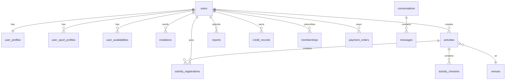

# USport 数据库设计说明

文档版本：V1.0  
更新时间：2026-03-22  
适用范围：MVP 及后续 1 到 2 个大版本

## 1. 设计目标

本设计以“运动搭子 + 活动组局 + 线下履约 + 信任治理”为核心，强调以下原则：

- 用户主数据唯一，不能因多端登录产生多份身份。
- 业务状态可追踪，不能只记录最终结果。
- 支持同城、多运动、不同活动类型。
- 能支撑举报、信用、会员和支付等后续能力扩展。
- 兼容当前已有 `users`、`venues`、`activities` 等基础表的演进。

## 2. 实体总览

核心实体分为 7 组：

1. 身份与资料：`users`、`user_profiles`、`user_sport_profiles`、`user_availabilities`
2. 匹配与邀约：`invitations`、`user_blocks`
3. 活动与履约：`activities`、`activity_registrations`、`activity_checkins`
4. 社交与通知：`conversations`、`messages`、`notifications`
5. 风控与信用：`reports`、`credit_records`
6. 交易与权益：`memberships`、`payment_orders`
7. 运营与场馆：`venues`、`admin_audit_logs`

## 3. 关系概览

## 4. 核心表设计

### 4.1 `users`

| 字段 | 类型 | 说明 |
| --- | --- | --- |
| id | bigint unsigned PK | 用户 ID |
| openid | varchar(100) unique | 微信 OpenID |
| unionid | varchar(100) index | 微信 UnionID |
| phone | varchar(20) unique nullable | 手机号 |
| nickname | varchar(50) | 默认昵称 |
| avatar_url | varchar(255) | 头像 |
| gender | tinyint | 0 未知 1 男 2 女 |
| city_code | varchar(20) | 当前城市编码 |
| register_source | varchar(20) | `mini_program` / `mobile` |
| auth_status | tinyint | 0 未认证 1 已认证 2 认证失败 |
| user_status | tinyint | 1 正常 2 限权 3 封禁 4 注销 |
| credit_score | int | 默认 100 |
| last_active_at | datetime | 最近活跃时间 |
| created_at | datetime(3) | 创建时间 |
| updated_at | datetime(3) | 更新时间 |

### 4.2 `user_profiles`

| 字段 | 类型 | 说明 |
| --- | --- | --- |
| id | bigint unsigned PK | 主键 |
| user_id | bigint unsigned unique | 用户 ID |
| bio | varchar(300) | 自我介绍 |
| birth_year | int | 出生年份 |
| height_cm | int nullable | 身高，可选 |
| occupation | varchar(50) | 职业 |
| residence_district | varchar(50) | 常活动区 |
| preferred_partner_gender | tinyint | 搭子性别偏好 |
| preferred_age_min | int | 偏好年龄下限 |
| preferred_age_max | int | 偏好年龄上限 |
| friendship_goal | varchar(20) | `training` / `social` / `competition` |
| allow_invite | tinyint | 是否允许陌生人邀约 |
| visibility_scope | varchar(20) | `public` / `verified_only` |
| created_at | datetime(3) | 创建时间 |
| updated_at | datetime(3) | 更新时间 |

### 4.3 `user_sport_profiles`

| 字段 | 类型 | 说明 |
| --- | --- | --- |
| id | bigint unsigned PK | 主键 |
| user_id | bigint unsigned index | 用户 ID |
| sport_code | varchar(30) index | 运动编码 |
| skill_level | varchar(20) | `beginner` / `intermediate` / `advanced` |
| frequency_per_week | tinyint | 周频次 |
| preferred_scene | varchar(30) | `casual` / `training` / `competition` |
| preferred_districts | json | 常活动区域 |
| preferred_time_slots | json | 常活动时段 |
| is_primary | tinyint | 是否主运动 |
| status | tinyint | 1 启用 0 关闭 |
| created_at | datetime(3) | 创建时间 |
| updated_at | datetime(3) | 更新时间 |

### 4.4 `user_availabilities`

| 字段 | 类型 | 说明 |
| --- | --- | --- |
| id | bigint unsigned PK | 主键 |
| user_id | bigint unsigned index | 用户 ID |
| weekday | tinyint | 1 到 7 |
| start_time | time | 开始时间 |
| end_time | time | 结束时间 |
| status | tinyint | 1 启用 0 停用 |
| created_at | datetime(3) | 创建时间 |
| updated_at | datetime(3) | 更新时间 |

### 4.5 `user_blocks`

| 字段 | 类型 | 说明 |
| --- | --- | --- |
| id | bigint unsigned PK | 主键 |
| user_id | bigint unsigned index | 发起人 |
| blocked_user_id | bigint unsigned index | 被拉黑人 |
| reason | varchar(100) | 原因 |
| status | tinyint | 1 生效 0 取消 |
| created_at | datetime(3) | 创建时间 |
| updated_at | datetime(3) | 更新时间 |

### 4.6 `invitations`

| 字段 | 类型 | 说明 |
| --- | --- | --- |
| id | bigint unsigned PK | 主键 |
| inviter_id | bigint unsigned index | 发起人 |
| invitee_id | bigint unsigned index | 接收人 |
| sport_code | varchar(30) index | 运动类型 |
| expected_date | date | 期望日期 |
| expected_time_slot | varchar(30) | 时间段 |
| district_code | varchar(30) | 期望区域 |
| venue_hint | varchar(100) | 场地偏好 |
| message | varchar(300) | 附言 |
| status | varchar(20) index | `pending` / `accepted` / `declined` / `expired` / `cancelled` |
| expire_at | datetime | 过期时间 |
| accepted_at | datetime nullable | 接受时间 |
| created_at | datetime(3) | 创建时间 |
| updated_at | datetime(3) | 更新时间 |

### 4.7 `venues`

| 字段 | 类型 | 说明 |
| --- | --- | --- |
| id | bigint unsigned PK | 主键 |
| city_code | varchar(20) index | 城市编码 |
| name | varchar(100) | 场馆名称 |
| sport_code | varchar(30) | 主运动类型 |
| address | varchar(255) | 详细地址 |
| district_code | varchar(30) | 行政区 |
| latitude | decimal(10,6) | 纬度 |
| longitude | decimal(10,6) | 经度 |
| cover_url | varchar(255) | 封面 |
| tags | json | 标签 |
| status | tinyint | 1 上线 0 下线 |
| created_at | datetime(3) | 创建时间 |
| updated_at | datetime(3) | 更新时间 |

### 4.8 `activities`

| 字段 | 类型 | 说明 |
| --- | --- | --- |
| id | bigint unsigned PK | 主键 |
| activity_no | varchar(40) unique | 活动编号 |
| creator_id | bigint unsigned index | 发起人 |
| activity_type | varchar(20) | `public` / `private` / `official` |
| sport_code | varchar(30) index | 运动类型 |
| title | varchar(100) | 标题 |
| description | varchar(1000) | 描述 |
| city_code | varchar(20) index | 城市 |
| district_code | varchar(30) index | 区域 |
| venue_id | bigint unsigned nullable | 场馆 ID |
| venue_name | varchar(100) | 场地名称快照 |
| address | varchar(255) | 地址快照 |
| start_time | datetime index | 开始时间 |
| end_time | datetime | 结束时间 |
| signup_deadline | datetime | 报名截止时间 |
| capacity | int | 人数上限 |
| waiting_capacity | int | 候补上限 |
| current_count | int | 当前已确认人数 |
| fee_type | varchar(20) | `free` / `aa` / `fixed_price` |
| fee_amount | decimal(10,2) | 固定费用 |
| join_rule | varchar(20) | `direct` / `approval_required` |
| visibility_scope | varchar(20) | `public` / `followers` / `invite_only` |
| min_skill_level | varchar(20) nullable | 最低技能要求 |
| gender_rule | varchar(20) | `all` / `male_only` / `female_only` |
| risk_flag | tinyint | 是否高风险场景 |
| status | varchar(20) index | `draft` / `published` / `full` / `in_progress` / `completed` / `cancelled` |
| cancel_reason | varchar(200) nullable | 取消原因 |
| published_at | datetime nullable | 发布时间 |
| completed_at | datetime nullable | 完成时间 |
| created_at | datetime(3) | 创建时间 |
| updated_at | datetime(3) | 更新时间 |

### 4.9 `activity_registrations`

| 字段 | 类型 | 说明 |
| --- | --- | --- |
| id | bigint unsigned PK | 主键 |
| activity_id | bigint unsigned index | 活动 ID |
| user_id | bigint unsigned index | 用户 ID |
| source | varchar(20) | 报名来源 |
| status | varchar(20) index | `pending` / `approved` / `waiting` / `rejected` / `cancelled` / `checked_in` / `completed` / `no_show` |
| pay_status | varchar(20) | `not_required` / `unpaid` / `paid` / `refunded` |
| applied_at | datetime | 报名时间 |
| approved_at | datetime nullable | 审核通过时间 |
| cancelled_at | datetime nullable | 取消时间 |
| cancel_reason | varchar(200) nullable | 取消原因 |
| operator_type | varchar(20) | `user` / `host` / `system` |
| created_at | datetime(3) | 创建时间 |
| updated_at | datetime(3) | 更新时间 |

### 4.10 `activity_checkins`

| 字段 | 类型 | 说明 |
| --- | --- | --- |
| id | bigint unsigned PK | 主键 |
| activity_id | bigint unsigned index | 活动 ID |
| user_id | bigint unsigned index | 用户 ID |
| checkin_type | varchar(20) | `self` / `host_confirm` / `system_geo` |
| checkin_status | varchar(20) | `pending` / `checked_in` / `absent_confirmed` |
| checkin_at | datetime nullable | 签到时间 |
| proof_data | json | 定位或证据 |
| created_at | datetime(3) | 创建时间 |
| updated_at | datetime(3) | 更新时间 |

### 4.11 `conversations`

| 字段 | 类型 | 说明 |
| --- | --- | --- |
| id | bigint unsigned PK | 主键 |
| scene_type | varchar(20) | `invitation` / `activity` / `service` |
| scene_id | bigint unsigned | 场景主键 |
| conversation_type | varchar(20) | `single` / `group` |
| status | tinyint | 1 正常 0 关闭 |
| last_message_at | datetime | 最近消息时间 |
| created_at | datetime(3) | 创建时间 |
| updated_at | datetime(3) | 更新时间 |

### 4.12 `messages`

| 字段 | 类型 | 说明 |
| --- | --- | --- |
| id | bigint unsigned PK | 主键 |
| conversation_id | bigint unsigned index | 会话 ID |
| sender_id | bigint unsigned index | 发送人 |
| message_type | varchar(20) | `text` / `image` / `system_card` |
| content | text | 文本内容 |
| extra_data | json | 扩展数据 |
| send_status | varchar(20) | `sent` / `delivered` / `failed` |
| created_at | datetime(3) | 创建时间 |
| updated_at | datetime(3) | 更新时间 |

### 4.13 `notifications`

| 字段 | 类型 | 说明 |
| --- | --- | --- |
| id | bigint unsigned PK | 主键 |
| user_id | bigint unsigned index | 接收人 |
| biz_type | varchar(30) index | 业务类型 |
| title | varchar(100) | 标题 |
| content | varchar(300) | 内容 |
| action_type | varchar(20) | `activity` / `invite` / `report` / `membership` |
| action_id | bigint unsigned | 目标对象 ID |
| read_status | tinyint | 0 未读 1 已读 |
| send_channel | varchar(20) | `in_app` / `wx_subscribe` / `push` |
| created_at | datetime(3) | 创建时间 |
| updated_at | datetime(3) | 更新时间 |

### 4.14 `reports`

| 字段 | 类型 | 说明 |
| --- | --- | --- |
| id | bigint unsigned PK | 主键 |
| reporter_id | bigint unsigned index | 举报人 |
| target_type | varchar(20) | `user` / `activity` / `message` |
| target_id | bigint unsigned index | 被举报对象 |
| reason_code | varchar(30) | 原因编码 |
| description | varchar(500) | 补充描述 |
| evidence_urls | json | 证据 |
| status | varchar(20) index | `pending` / `processing` / `confirmed` / `rejected` / `closed` |
| result_action | varchar(30) | `warning` / `credit_deduct` / `ban` / `none` |
| processed_by | bigint unsigned nullable | 处理人 |
| processed_at | datetime nullable | 处理时间 |
| created_at | datetime(3) | 创建时间 |
| updated_at | datetime(3) | 更新时间 |

### 4.15 `credit_records`

| 字段 | 类型 | 说明 |
| --- | --- | --- |
| id | bigint unsigned PK | 主键 |
| user_id | bigint unsigned index | 用户 ID |
| biz_type | varchar(30) | `no_show` / `late` / `report_confirmed` / `host_quality` |
| biz_id | bigint unsigned | 关联业务 ID |
| change_value | int | 变更分值 |
| balance_after | int | 变更后信用分 |
| reason | varchar(200) | 说明 |
| created_at | datetime(3) | 创建时间 |

### 4.16 `memberships`

| 字段 | 类型 | 说明 |
| --- | --- | --- |
| id | bigint unsigned PK | 主键 |
| user_id | bigint unsigned index | 用户 ID |
| membership_type | varchar(20) | `monthly` / `quarterly` / `yearly` |
| status | varchar(20) index | `pending` / `active` / `expired` / `cancelled` |
| start_at | datetime | 生效时间 |
| end_at | datetime | 失效时间 |
| auto_renew | tinyint | 是否自动续费 |
| rights_snapshot | json | 权益快照 |
| created_at | datetime(3) | 创建时间 |
| updated_at | datetime(3) | 更新时间 |

### 4.17 `payment_orders`

| 字段 | 类型 | 说明 |
| --- | --- | --- |
| id | bigint unsigned PK | 主键 |
| order_no | varchar(40) unique | 订单号 |
| user_id | bigint unsigned index | 用户 ID |
| biz_type | varchar(30) | `membership` / `official_activity` |
| biz_id | bigint unsigned | 业务 ID |
| amount | decimal(10,2) | 金额 |
| currency | varchar(10) | 币种 |
| pay_channel | varchar(20) | `wechat_pay` |
| status | varchar(20) index | `created` / `paying` / `paid` / `failed` / `refunded` |
| paid_at | datetime nullable | 支付时间 |
| refund_at | datetime nullable | 退款时间 |
| channel_transaction_no | varchar(64) nullable | 渠道流水 |
| created_at | datetime(3) | 创建时间 |
| updated_at | datetime(3) | 更新时间 |

### 4.18 `admin_audit_logs`

| 字段 | 类型 | 说明 |
| --- | --- | --- |
| id | bigint unsigned PK | 主键 |
| operator_id | bigint unsigned index | 操作人 |
| module | varchar(30) | 模块 |
| action | varchar(30) | 动作 |
| target_type | varchar(20) | 对象类型 |
| target_id | bigint unsigned | 对象 ID |
| before_data | json | 变更前 |
| after_data | json | 变更后 |
| ip | varchar(50) | 操作 IP |
| created_at | datetime(3) | 创建时间 |

## 5. 关键状态定义

### 5.1 邀约状态

- `pending`
- `accepted`
- `declined`
- `expired`
- `cancelled`

### 5.2 活动状态

- `draft`
- `published`
- `full`
- `in_progress`
- `completed`
- `cancelled`

### 5.3 报名状态

- `pending`
- `approved`
- `waiting`
- `rejected`
- `cancelled`
- `checked_in`
- `completed`
- `no_show`

### 5.4 举报状态

- `pending`
- `processing`
- `confirmed`
- `rejected`
- `closed`

### 5.5 订单状态

- `created`
- `paying`
- `paid`
- `failed`
- `refunded`

## 6. 索引建议

重点索引：

- 用户：`openid`、`phone`、`city_code`、`user_status`
- 运动画像：`(user_id, sport_code)`、`sport_code + skill_level`
- 邀约：`invitee_id + status`、`inviter_id + created_at`
- 活动：`city_code + sport_code + start_time`、`creator_id + status`
- 报名：`activity_id + status`、`user_id + status`
- 举报：`target_type + target_id`、`reporter_id + created_at`
- 订单：`order_no`、`user_id + status`

## 7. 与当前代码的兼容策略

当前仓库已存在：

- `users`
- `venues`
- `activities`
- `bookings`

问题在于：

- 现有 `users` 字段不足以表达完整用户画像和认证状态。
- 现有 `activities` 更像基础活动表，缺少报名、状态机、费用、可见性、审核规则。
- `bookings` 更像场馆预订，不适合作为 USport 活动报名主表。

建议迁移策略：

1. 保留现有 `users` 表并增量补字段。
2. 新增 `user_profiles`、`user_sport_profiles`、`user_availabilities`。
3. 保留 `venues`，但补充城市、经纬度、标签字段。
4. 对 `activities` 执行结构升级。
5. 新增 `activity_registrations`，不要继续用 `bookings` 表承载活动报名。
6. `bookings` 可转为未来场馆预订能力预留，不纳入 MVP 主链路。

## 8. 结论

USport 的数据库设计必须围绕“人、局、履约、信任、权益”五个中心建立。只要核心状态和关系在数据库层设计清楚，多端架构才能稳定落地，前后端也才能围绕统一事实源协同开发。
